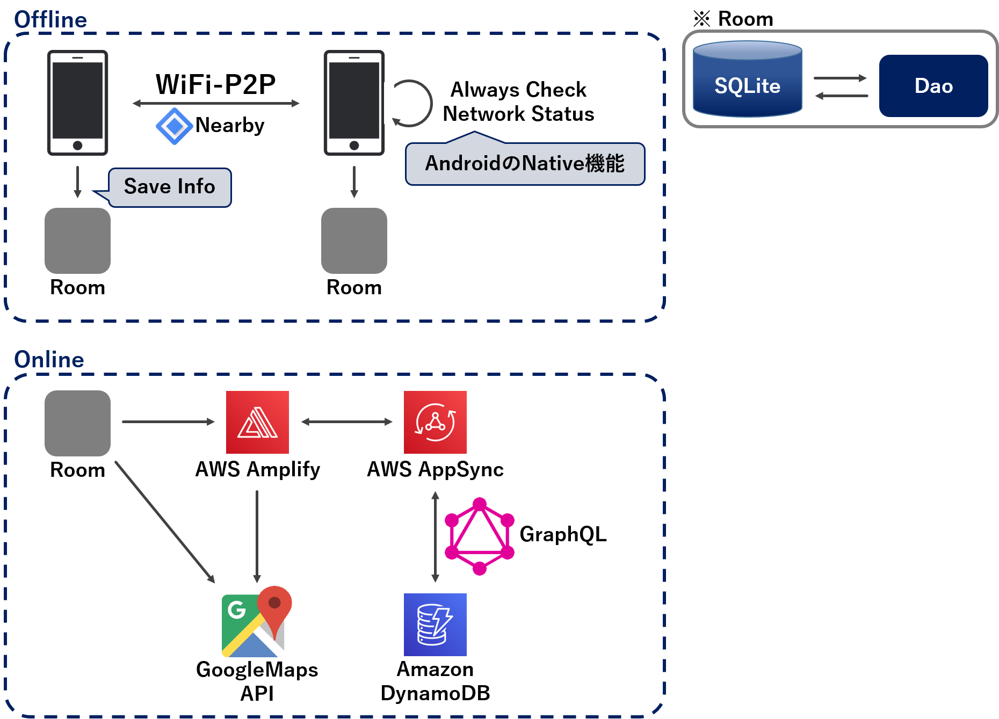

# [井戸端会議のSNS 井戸端er](https://jphacks.github.io/KB_1914/)

## 製品概要
### [井戸端会議 X Tech](https://jphacks.github.io/KB_1914/)

* 情報が溢れる時代に、あえて近くの人にしか届かないSNSを。
* 遠くの親類より近くの他人。正直、東京の大事件より近所のゴシップの方がオモシロイ!!!

### 背景（製品開発のきっかけ、課題等）
- 簡単に情報が手に入る時代だが、遠くの情報や昔の情報にはあまり興味が無い。今、近くで発信された情報を得られる仕組みがあるといいのでは。
- 今近くにいる人に呼びかけたい店舗や個人、新鮮な情報を欲する人。現状では遠くのことや昔のことなど自分に関わりの薄い情報があふれている。

### 製品説明（具体的な製品の説明）
* 井戸端会議をテーマにしたSNSです。
* 安易にGPSを用いるのではなく、P2P通信を用いて、今、近くで発信された情報だけを表示します。
* 投稿した情報が人伝いに どれだけ拡散されたか、ひと目で分かるSNSです!

### 特長

#### 1. 特長1
* **オフラインのP2P**を使うことで、物理的に近い距離でだけ情報交換が行われる(井戸端会議らしさ)
  * 地域密着型SNS
  * オフラインで利用可能なSNS
  * 安易にGPSを用いるのではなく、あえてP2P通信を用いた

#### 2. 特長2
* 人伝いに情報が拡散されていくようすがひと目で分かる

#### 3. 特長3
* 新しい形の広告配信としても利用可能
  * 物理的に近い人を対象に配信できるため、見込み客を多く獲得できる
  * お店は、時間制限を設けたクーポンを配布することで、**今だけ**に弱い人間の心理を利用可能な今までにないタイムセールを実施できる

### 解決出来ること
* 今この瞬間、近くで発せられた「新鮮な」メッセージだけを表示
* 店舗のタイムセールや路上ライブなどで、今近くにいる人にリーチできる
* 匿名かつ期限で消えるので炎上しにくい、デジタルタトゥーになりにくい
* オフラインなのでサーバが破壊される等の心配がないため、災害時に**地域の情報交換**で活躍できる 
（〇〇で水が足りてない！人手が欲しい！）

### 今後の展望
* 投稿に時間、ホップ数、距離の制限を付け、期限になると投稿が破棄されるようにすることで、より時間と地域に限定的な情報にする。
* 投稿にいいねする機能を付け、いいねされた投稿を優先的にホップする
* 法人向けに投稿がホップしやすくなる有料プランを提供する。
* ビーコンを用いた広告配信等

## 開発内容・開発技術
### 活用した技術
#### フレームワーク・ライブラリ・モジュール
* Nearby
* Amplify
* AppSync
* GraphQL
* Amazon dinamoDB

#### デバイス
* android
* ビーコン(将来的に)

#### API・データ
今回スポンサーから提供されたAPI、製品などの外部技術があれば記述をして下さい。

* なし

### 研究内容・事前開発プロダクト（任意）
ご自身やチームの研究内容や、事前に持ち込みをしたプロダクトがある場合は、こちらに実績なども含め記載をして下さい。

以下の２点のみ
* 作る物のアイディア
* [画面のイメージ図](https://xd.adobe.com/spec/3ca0c14b-c817-407b-4d66-d9307c93f2ce-4a91/)

### 独自開発技術（Hack Dayで開発したもの）
#### 2日間に開発した独自の機能・技術
* 独自で開発したものの内容をこちらに記載してください
オフライン時に端末のローカルデバイスにP2P通信で受け取った情報や投稿内容を保存して、オンライン時にいつ何処で受け取ったのかという情報をアップロード。

* 特に力を入れた部分をファイルリンク、またはcommit_idを記載してください（任意）
 * [00ec694dc86d2ef8f9dd658c76d5b7ebab1fb3bc](https://github.com/jphacks/KB_1914/commit/00ec694dc86d2ef8f9dd658c76d5b7ebab1fb3bc)
 * [dfd3d9e8be7c03e0c87c73ae5365a17b8881ce37](https://github.com/jphacks/KB_1914/commit/dfd3d9e8be7c03e0c87c73ae5365a17b8881ce37)

  
👇👇 ホームページはこちら👇👇 
https://jphacks.github.io/KB_1914/
